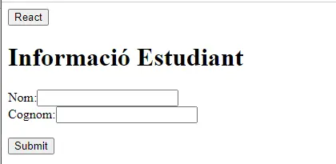
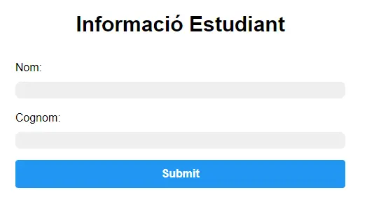
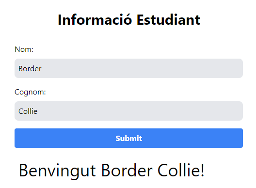
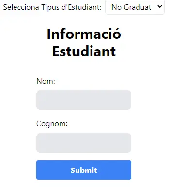
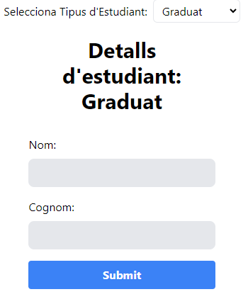
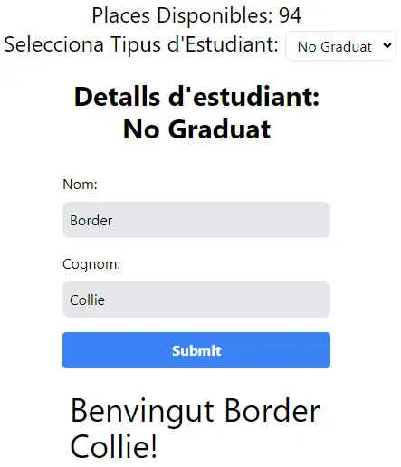

# React - Vol I

Amb aquesta pràctica anem a familiaritzar-nos amb (un possible) entorn de desenvolupament de React i els primers passos per crear una aplicació.

## Documentació oficial de React

La documentació de React és extensa i està plena d'exemples que ens poden ser de gran ajuda. Compte, perquè la documentació actual es troba a [React](https://react.dev/) i no a [ReactJS](https://reactjs.org/), on trobaràs la documentació de versions anteriors (tot i que hi ha parts que poden ser vàlides i les trobaràs en castellà, és recomanable utilitzar la documentació oficial actualitzada).

## Instal·lació

Et proposem un boilerplate per a React que utilitza [Vite](https://vitejs.dev/) com a eina de desenvolupament. Podeu trobar més informació sobre Vite a la seva [documentació](https://vitejs.dev/guide/). Vite a data d'avui (Abril 2024) és un bundler que està guanyant molta popularitat i que té un rendiment molt superior a altres bundlers com Webpack o Parcel. Es possible que trobeu força recursos relacionats amb React que fan referència al seu ús.

1. Cloneu aquest repositori al vostre ordinador local.
2. Navegueu fins al directori del projecte.
3. Executeu `npm install` per instal·lar les dependències del projecte.

## Execució del projecte

Per iniciar el servidor de desenvolupament, executeu `npm run dev`. Això iniciarà el servidor de desenvolupament Vite. Podeu veure l'aplicació obrint `http://localhost:3000` al vostre navegador.

## Estructura del projecte

El projecte té la següent estructura:

- `src/App.jsx`: Aquest és el component principal de l'aplicació. És responsable de renderitzar la disposició principal de l'aplicació i altres components.
- `src/index.jsx`: Aquest és el punt d'entrada de l'aplicació. És responsable de renderitzar el component `App` i adjuntar-lo al DOM.
- `src/components/HelloWorld.jsx`: Aquest és un component senzill que mostra un missatge "Hola, món!". És utilitzat pel component `App`.
- `vite.config.js`: Aquest és el fitxer de configuració per a Vite. S'utilitza per personalitzar el comportament de Vite, com ara definir àlies i canviar el directori de sortida de la compilació.
- `package.json`: Aquest és el fitxer de configuració per a npm. Llista les dependències i scripts del projecte.

## Anem a practicar:
### Descripció del que haurà de fer l'aplicació


- **Selecció del tipus d'estudiant:** L'usuari pot seleccionar si l'estudiant és graduat o no mitjançant un desplegable. Aquesta selecció canvia dinàmicament el contingut de la pàgina.
  
- **Renderització condicional:** Depenent de la selecció de l'usuari (graduat o no graduat), el formulari mostrarà missatges diferents. 
  
- **Formulari d'entrada d'informació:** L'aplicació inclou un formulari que demana el nom i cognom de l'estudiant. L'usuari pot introduir aquesta informació i enviar-la mitjançant el botó "Enviar".
  
- **Estilització amb Tailwind CSS:** El formulari i la interfície tenen estils aplicats amb TailwindCSS, que donen un aspecte modern i responsiu amb poques línies de codi.

### Introducció als Components

Els components són els blocs de construcció de qualsevol aplicació React. La interfície d'usuari (UI) d'una aplicació React és un component, i pot estar formada per múltiples components. Imagina que tens una paret de maons i cada maó aquí és un component que forma part del component final, la paret.

Un component és una classe o funció de JavaScript que pot opcionalment prendre algun "input" i retorna un element React. Aquest element defineix com ha d'aparèixer una certa part de la UI. Anem a veure-ho amb el cas del nostre HelloWorld.

```jsx
import React from "react"; // Importem la llibreria de React

function HelloWorld() {
  // Declarem la funció HelloWorld
  return <h1>Hola, món!</h1>; // Retornem un element React
}

export default HelloWorld; // Exportem la funció HelloWorld
```

Si estàs visualitzant aquest document en un navegador, pots veure el resultat de l'execució del component `HelloWorld` a la part superior de la pàgina. En aquest projecte el component `HelloWorld` està sent importat i utilitzat pel component `App` que a la vegada és utilitzat pel component `main`.

Modifica la funció `HelloWorld` amb el següent codi:

```jsx
function HelloWorld() {
  const handleClick = () => {
    alert("Hello World!");
  };
  return (
    <div className="App">
      <button onClick={handleClick}>React</button>
    </div>
  );
}
```

**Funciona?**

Veureu que la pàgina del navegador s'actualitza i apareix el botó React. Quan feu clic, obtindreu l'alerta. Aquest component és un exemple d'un component funcional. Aquest no té paràmetres d'entrada, simplement retorna l'element que descriu com ha de ser l'aspecte de la secció de la UI:

```jsx
<div className="App">
  <button onClick={handleClick}>React</button>
</div>
```

El clic del botó invoca una funció `handleClick`. Aquesta funció també forma part del component HelloWorld. Aquesta funció mostra una alerta amb el text "Hello World!".

Finalment exportem la funció `HelloWorld` perquè pugui ser utilitzada per altres components.

```jsx
export default HelloWorld;
```

Així doncs un component conté tant la lògica com la UI. Això és una de les coses que fa que React sigui tan popular permetent que els desenvolupadors puguin crear components reutilitzables i mantenibles. És important que fragmentem la nostra aplicació en components petits i orientats a resolde una única tasca.

## Renderitzant Components

En React, el procés de renderitzar components és essencial per mostrar el contingut de l’aplicació en pantalla. Aquest procés implica utilitzar el mòdul ReactDOM per afegir el component principal de l’aplicació al DOM del navegador.

### Com funciona la renderització?

Per renderitzar un component en React, fem servir la funció `createRoot` (versió recomanada des de React 18) en lloc de `ReactDOM.render`. Aquesta funció necessita:

- El component que volem renderitzar.
- L'element del DOM on volem inserir el component.

### Exemple de renderització amb `createRoot`

```jsx
import React from "react";
import { createRoot } from "react-dom/client";
import App from "./App";

const root = createRoot(document.getElementById("root"));
root.render(
  <React.StrictMode>
    <App />
  </React.StrictMode>
);
```

Aquí `createRoot` troba l'element amb l'ID `root` al DOM i renderitza el component `App` dins d'aquest. L'element `<React.StrictMode>` envolta `App` per ajudar a detectar possibles problemes i bones pràctiques durant el desenvolupament.

## JSX

JSX és una extensió de sintaxi que permet escriure HTML dins de JavaScript. Malgrat la seva semblança amb HTML, JSX no és HTML, sinó un format que React utilitza per descriure la interfície d’usuari (UI).

### Característiques de JSX

- **Llenguatge de marcatge**: JSX permet escriure codi semblant a HTML directament dins de JavaScript.
- **Transformació automàtica**: React i eines com Vite transpilen JSX a JavaScript vàlid abans d’executar el codi.

### Exemples de diferències entre HTML i JSX

- **className vs class**: En JSX, utilitzem `className` en lloc de `class` perquè `class` és una paraula reservada en JavaScript.

```jsx
// HTML
<div class="App">
  <button>React</button>
</div>

// JSX
<div className="App">
  <button>React</button>
</div>
```

- **camelCase pels esdeveniments**: En lloc de `onclick`, utilitzem `onClick` amb camelCase per seguir les normes de JavaScript.

```jsx
// HTML
<button onclick="handleClick()">React</button>

// JSX
<button onClick={handleClick}>React</button>
```

### Altres diferències destacables

- **camelCase per a atributs** en lloc de kebab-case (per exemple, `tabIndex` en lloc de `tabindex`).
- **Ús de paraules reservades**: No es poden utilitzar paraules reservades de JavaScript com `class` o `for`; en canvi, s’utilitzen `className` i `htmlFor`.
- **Un sol element contenedor**: JSX requereix un únic element contenedor per cada expressió. Això vol dir que, si es volen retornar diversos elements, s’ha d’embolcallar amb un `<div>`, `<React.Fragment>`, o amb `<>...</>`.

### Incloure expressions de JavaScript

Amb JSX, podem incloure expressions de JavaScript dins de `{}`:

```jsx
const username = "Anna";
const greeting = <h1>Hello, {username}!</h1>;
```

### Recursos addicionals

Per obtenir més informació sobre JSX i la seva sintaxi, podeu consultar la documentació oficial de React:

- [Wrtiting Markup with JSX](https://react.dev/learn/writing-markup-with-jsx)
- [JavaScript in JSX with Curly Braces](https://react.dev/learn/javascript-in-jsx-with-curly-braces)

### Reaccionant a Inputs

Anem a crear un component formulari i mostra-ho per pantalla.

Crea un component addicional anomenat `Form` a la carpeta `components`. Aquest component tindrà un input de text i un botó. Quan l'usuari faci clic al botó, el text de l'input es mostrarà per pantalla.

```jsx
import React from "react";
function Form() {
  return (
    <div>
      <form>
        <h1>Informació Estudiant</h1>
        <label>Nom:</label>
        <input type="text" name="fname" />
        <br />
        <label>Cognom:</label>
        <input type="text" name="lname" />
        <br />
        <br />
        <input type="submit" value="Submit" />
      </form>
    </div>
  );
}
export default Form;
```

Afegeix el component `Form` al component `App` i mostra'l per pantalla com es veu en la següent imatge:



T'hauria de cridar l'atenció la manera en com has d'injectar el component `Form` dins del component `App`. Això és una de les característiques més potents de React. Els components poden ser injectats dins d'altres components. Com ja has pogut veure amb el cas del HelloWorld, podem injectar components fent ús de la sintaxi `<ElMeuComponent />`:

```jsx
import React from "react";
import HelloWorld from "./components/HelloWorld";
import Form from "./components/Form"; // Importem el component Form

function App() {
  return (
    <div className="App">
      <HelloWorld />
      <Form /> // Injectem el component Form
    </div>
  );
}

export default App;
```

### Estils dels components

Podem aplicar estils als components de dues maneres:

- Utilitzant la propietat `style` dels elements JSX
- Utilitzant CSS

Òbviament la manera més habitual de fer-ho és utilitzant CSS, però nosaltres, ja que hem vist TailwindCSS, anirem un passet més enllà i ho farem amb aquest.

### TailwindCSS amb Vite

Això no té res a veure amb React però ens permetrà fer ús d'una eina que ja coneixem i que ens permet obtenir resultats molt vistosos i professionals amb poques línies de codi.

Per poder utilitzar Tailwind al nostre projecte de React hem de seguir els següents passos (alguns d'ells potser no caldrien ja que el boilderplate ja els té fets):

1. Instal·lar TailwindCSS i PostCSS

```bash
npm install -D tailwindcss@latest postcss@latest autoprefixer@latest
```

2. Crear un fitxer de configuració per a TailwindCSS

```bash
npx tailwindcss init -p
```

Pots afegir el següent contingut al fitxer `tailwind.config.js`:

```js
module.exports = {
  content: ["./index.html", "./src/**/*.{js,jsx,ts,tsx,vue}"],
  darkMode: false, // or 'media' or 'class'
  theme: {
    extend: {},
  },
  variants: {
    extend: {},
  },
  plugins: [],
};
```

Bàsicament podem configurar sobre quins fitxers s'aplicarà TailwindCSS. Per més informació sobre la configuració de TailwindCSS pots consultar la seva [documentació](https://tailwindcss.com/docs/configuration).
Amb això TailwindCSS ja està configurat per a utilitzar els colors, fonts, etc. que necessita.

3. Configurar PostCSS

Si no existeix, crea `postcss.config.js`:

```bash
touch postcss.config.js
```

```js
export default {
  plugins: {
    tailwindcss: {},
    autoprefixer: {},
  },
};
```

4. Configurar Vite per utilitzar PostCSS

```js
// vite.config.js
import { defineConfig } from "vite";
import reactRefresh from "@vitejs/plugin-react-refresh";
import tailwindcss from "tailwindcss";
import autoprefixer from "autoprefixer";

export default defineConfig({
  plugins: [reactRefresh()],
  css: {
    postcss: {
      plugins: [tailwindcss, autoprefixer],
    },
  },
});
```

5. Importar TailwindCSS al nostre projecte

```css
/* src/index.css */
@tailwind base;
@tailwind components;
@tailwind utilities;
```

```js
// src/index.js
import React from 'react';
import ReactDOM from 'react-dom';
import './index.css';
...
```

6. Utilitzar TailwindCSS

Pots aplicar els estils de Tailwind fent servir classNames a les teves etiquetes HTML:

```jsx
// src/components/Form.jsx
import React from "react";

function Form() {
  return (
    <div className="flex justify-center items-center h-screen">
      <form className="w-1/2">
        <h1 className="text-3xl font-bold text-center mb-8">
          Informació Estudiant
        </h1>
        ....
      </form>
    </div>
  );
}

export default Form;
```

Intenta afegir estils a la resta del formulari de manera que acabis tenint quelcom semblant a la següent imatge:


## Estat a React

Ara aprofundirem en un concepte essencial de React: l'estat (state). L'estat és una de les característiques principals de React que permet als components gestionar dades internes que poden canviar al llarg del temps, mantenint aquestes dades fins i tot després de sortir d’una funció. Això fa possible crear aplicacions dinàmiques i interactives.

A continuació, afegirem funcionalitat interactiva al nostre formulari d’estudiants. Volem que aparegui un missatge de benvinguda personalitzat quan l’usuari introdueixi el seu nom i cognom.

### 1. Importar la funció `useState`

Primer, cal importar `useState` de React per gestionar l’estat dins del component. La funció `useState` permet crear una variable d’estat i una funció per modificar-la.

```jsx
import React, { useState } from "react";
```

### 2. Crear variables d’estat

Utilitzem `useState` per crear una variable `firstName` per guardar el nom de l’usuari i una funció `setFirstName` per actualitzar-ne el valor. En el nostre exemple, aquesta inicialitzarà amb una cadena buida (`""`).

```jsx
const [firstName, setFirstName] = useState("");
```

### 3. Actualitzar l’estat amb `onBlur`

Per emmagatzemar el nom de l’usuari mentre escriu, assignem la funció `setFirstName` a l’esdeveniment `onBlur` de l’input. Això farà que el valor de `firstName` s’actualitzi quan l’usuari surti de l’input.

```jsx
<input
  className="w-full mb-4 p-2 rounded-lg bg-gray-200"
  type="text"
  name="fname"
  onBlur={(e) => setFirstName(e.target.value)}
/>
```

Repetim aquest pas per capturar també el cognom de l'usuari, creant un altre estat `lastName` i la funció `setLastName`.

### 4. Mostrar el missatge de benvinguda amb `welcomeMessage`

Ara afegirem un missatge de benvinguda utilitzant una altra variable d'estat, `welcomeMessage`, per emmagatzemar el text de benvinguda personalitzat. Col·loca un `<label>` al final del formulari per mostrar aquest missatge.

```jsx
const [welcomeMessage, setWelcomeMessage] = useState("");

<label className="block w-full text-4xl mb-4 p-2" id="studentMsg">
  {welcomeMessage}
</label>
```

### 5. Actualitzar `welcomeMessage` amb `onSubmit`

Finalment, volem que aparegui un missatge de benvinguda quan s’enviï el formulari amb el botó Submit. Per fer-ho, afegirem una funció `handleSubmit` que actualitzarà `welcomeMessage` i evitarem que el formulari es refresqui automàticament amb `e.preventDefault()`.

```jsx
<form className="w-1/2" onSubmit={handleSubmit}>
  ...
</form>
```

I aquí tens la funció `handleSubmit`:

```jsx
const handleSubmit = (e) => {
  e.preventDefault();
  setWelcomeMessage(`Hola ${firstName} ${lastName}!`);
};
```

> **Nota:** Per accedir a variables dins de JSX, cal fer ús de `{}`. Per exemple, `{welcomeMessage}`.

Si has seguit aquests passos correctament, hauries de veure un formulari que, en enviar-se, mostra un missatge de benvinguda personalitzat per l’usuari.



A continuació tens el codi complet del component `Form`:

```jsx
import React, { useState } from "react";

function Form() {
  const [firstName, setFirstName] = useState("");
  const [lastName, setLastName] = useState("");
  const [welcomeMessage, setWelcomeMessage] = useState("");
  const handleSubmit = (e) => {
    setWelcomeMessage(`Benvingut ${firstName} ${lastName}!`);
    e.preventDefault(); // Necessari per evitar que el form es refresqui
  };

  return (
    <div className="flex justify-center items-center h-screen">
      <form className="w-1/2" onSubmit={handleSubmit}>
        <h1 className="text-3xl font-bold text-center mb-8">
          Informació Estudiant
        </h1>
        <label className="block mb-2">Nom:</label>
        <input
          className="w-full mb-4 p-2 rounded-lg bg-gray-200"
          type="text"
          name="fname"
          onBlur={(event) => setFirstName(event.target.value)}
        />
        <label className="block mb-2">Cognom:</label>
        <input
          className="w-full mb-4 p-2 rounded-lg bg-gray-200 border-1 border-dotted border-black"
          type="text"
          name="lname"
          onBlur={(event) => setLastName(event.target.value)}
        />
        <input
          className="w-full mb-4 p-2 bg-blue-500 hover:bg-blue-700 text-white font-bold py-2 px-4 rounded"
          type="submit"
          value="Submit"
        />
        <label className="block w-full text-4xl mb-4 p-2" id="studentMsg">
          {welcomeMessage}
        </label>
      </form>
    </div>
  );
}

export default Form;
```

> Nota: Utilitzem `event.preventDefault( )` per evitar que el navegador carregui una nova pàgina quan fem submit, que és un comportament natiu del botó d'enviament.

### Virtual DOM

No entrarem a explicar els detalls de què és el DOM i com ho fa servir React, però és una de les característiques que ha fet que React s'hagi popularitzat tant i que permet que només es facin canvis allà on és estrictament necessari. Això fa que les aplicacions React siguin mol eficients. Si vols saber més sobre el DOM i el Virtual DOM pots consultar la [documentació](https://reactjs.org/docs/faq-internals.html). Si vols més detalls, tens una molt bona explicació a [Logrocket](https://blog.logrocket.com/virtual-dom-react/).

### Props (SUPER IMPORTANT!)

Les **Props** a React són com els **atributs** a HTML. Són passades a un component com a paràmetres. Aquestes són utilitzades per personalitzar el component. Et deixo un video aclaratiu que et recomano abans d'entrar a fer-ho tu mateix:

[Comunicación entre componentes - Props](https://www.youtube.com/watch?v=wVxvXybXObg&ab_channel=FernandoHerrera)

Per exemple, podem passar el nom de l'usuari com a prop al component `Form`:

Anem a continuar amb el nostre formulari. Imagina que volem un títol diferent en funció dels estudiants per al que s'estigui mostrant:

- Per a estudiants en actiu --> Estudiants **"No-Graduats"**
- Per a estudiants que ja han acabat els estudis **"Estudiants Graduats"**

Per aconseguir-ho, imaginem que li fem arribar aquesta informació des del component `App` al component `Form` a través d'una prop. El component `App` és el component pare aquí, i `Form` és el component fill. Afegim un element desplegable al component `App` perquè l'usuari pugui triar entre estudiant de "no-graduat" o de "graduat". Recorda que hauràs d'importar la funció `useState` a `App`. Un cop ho tinguis, el codi hauria de ser semblant a aquest:

```jsx
import React from "react";
import { useState } from "react";
import Form from "./components/Form";

function App() {
  const [tipusEstudiant, setTipusEstudiant] = useState("no-graduat"); // Afegim la variable d'estat tipusEstudiant
  const handleChange = (e) => {
    setTipusEstudiant(e.target.value);
  }; // Afegim la funció que actualitza el valor de la variable d'estat tipusEstudiant
  return (
    <div className="flex flex-col items-center justify-center gap-5 h-screen">
      <div className="tipusEstudiant">
        <label className="mr-2">Selecciona Tipus d'Estudiant:</label>
        // Afegim el desplegable que permet triar d'acord amb les variables i que
        crida la funció handleChange
        <select
          className="appDropDown border rounded-md py-1 px-2"
          onChange={handleChange}
          value={tipusEstudiant}
        >
          <option value="no-graduat">No Graduat</option>
          <option value="graduat">Graduat</option>
        </select>
      </div>
      <Form tipusEstudiantSelect={tipusEstudiant} />
    </div>
  );
}
```

Fixa't que hem afegit tota la lògica del desplegable al component `App`. Ara només ens queda passar el valor de la variable d'estat `tipusEstudiant` al component `Form` com a prop. Per fer-ho, ho hem aconseguit afegint el codi al component `App`:

```jsx
<Form tipusEstudiantSelect={tipusEstudiant} />
```

Podem anomenar el **prop** com vulguem, però és una bona pràctica utilitzar el mateix nom de la variable d'estat. En aquest cas ens hem permès passar-ho amb un nom més autoexplicatiu per fer-ne ús al component `Form`. Ara ja hauries de poder veure el següent resultat:



Ara per canviar el títol del formulari en funció del tipus d'estudiant, només ens queda fer ús de la prop `tipusEstudiant` al component `Form`. Hem de dur a terme dues accions:

- Passar la prop al component `Form` a través de la funció.
- Utilitzar la prop al component `Form`.

Per passar la prop al component `Form` a través de la funció, només hem d'afegir la prop al component `Form`:

```jsx
<Form tipusEstudiantSelect={tipusEstudiant} />
```

Per utilitzar la prop al component `Form`, hem de passar el paràmetre `props` a la funció `Form` i utilitzar la prop `tipusEstudiantSelect` al component `Form`:

```jsx
function Form(props) {
  return (
    <div className="flex justify-center items-center h-screen">
      <form className="w-1/2" onSubmit={handleSubmit}>
        <h1 className="text-3xl font-bold text-center mb-8">
          Detalls d'estudiant: {props.tipusEstudiantSelect}
        </h1>
        ...
      </form>
    </div>
  );
}
```

Finalment haurieu de poder canviar el títol del formulari en funció del tipus d'estudiant i veure quelcom semblant a la següent imatge:



### Passar dades del component fill al component pare (Child to Parent)

Fins ara, hem vist com passar dades del component pare (`App`) al component fill (`Form`) mitjançant props. Ara aprendrem a passar dades del component fill al component pare, una tècnica coneguda com a Child to Parent Communication.

#### Com funciona la comunicació Child to Parent?

Els components fills no poden passar dades directament als seus components pares. En canvi, el component pare ha de passar una funció al fill com a prop. Quan el fill crida aquesta funció (coneguda com a callback), pot enviar dades al component pare.

#### Exemple: Actualitzar places disponibles per a estudiants

Imagina que el formulari gestiona places limitades per a estudiants graduats i no graduats. Quan l’usuari envia un nou registre, volem reduir el nombre de places disponibles i mostrar-lo a l’aplicació. Tenim un límit de 100 places: 
```jsx
const [places, setPlaces] = useState(100);
```

Ara, creem una funció `setPlacesDisponibles` que actualitzi el valor de la variable d'estat `places`:

```jsx
const setPlacesDisponibles = (updatedPlaces) => {
  setPlaces(updatedPlaces);
};
```

Passem la funció `setPlacesDisponibles` i les places disponibles en aquell moment com a `placesActuals` al component `Form`:

```jsx
<Form
  tipusEstudiantSelect={tipusEstudiant}
  setPlacesDisponibles={setPlacesDisponibles}
  placesActuals={places}
/>
```

Vegem novament com quedaria App:

```jsx
import React from "react";
import { useState } from "react";
import Form from "./components/Form";

function App() {
  const [tipusEstudiant, setTipusEstudiant] = useState("No Graduat");
  const [places, setPlaces] = useState(100);
  const handleChange = (e) => {
    setTipusEstudiant(e.target.value);
  };
  // Afegim la funció que actualitza el valor de la variable d'estat places
  const setPlacesDisponibles = (updatedPlaces) => {
    setPlaces(updatedPlaces);
  };
  return (
    <div className="flex flex-col items-center justify-center gap-5 h-screen">
      <div className="tipusEstudiant">
        // Afegim una nova etiqueta que mostra el nombre de places disponibles
        <label className="text-2xl text-center mx-2 block">
          Places Disponibles: {places}
        </label>
        <label className="text-2xl mx-2">Selecciona Tipus d'Estudiant:</label>
        <select
          className="appDropDown border rounded-md py-1 px-2"
          onChange={handleChange}
          value={tipusEstudiant}
        >
          <option value="No Graduat">No Graduat</option>
          <option value="Graduat">Graduat</option>
        </select>
      </div>
      // Afegim les dues noves props al component Form
      <Form
        tipusEstudiantSelect={tipusEstudiant}
        setPlacesDisponibles={setPlacesDisponibles}
        placesActuals={places}
      />
    </div>
  );
}

export default App;
```

Ens queda actualitzar la informació al component `Form` perquè quan es faci submit, es passi la informació al component `App`.

```jsx
const handleSubmit = (e) => {
  e.preventDefault();
  setWelcomeMessage(`Benvingut ${firstName} ${lastName}!`);
  // Afegim la crida a la funció setPlacesDisponibles
  props.setPlacesDisponibles(props.placesActuals - 1);
};
```

Vegem la foto del resultat:



Amb això ja hem vist com passar dades del component fill al component pare.

### Props i State

Anem a insistir en la diferència entre Props i State per saber quan fer-ne ús d'un o altre.

- Les `props` son només de lectura mentre que l'estat (`state`) pot ser modificat.
- Les `props` són passades a un component com a paràmetres mentre que l'estat (`state`) és definit dins d'un component.
- Amb `state`podem emmagatzemar dades i fer que el nostre component sigui interactiu actualitzant el seu valor o estat. Si ens volem comunicar o accedir a l'estat d'un altre component, llavors utilitzarem `props`.
- Les `props` poden pasar informació a través de l'arbre de components "top to bottom" (de pare a fill) mentre que l'estat (`state`) només pot ser passat de la manera que hem vist abans a través d'un callback

### React condicional

Anem a veure el darrer concepte de react condicional que ens permetrà mostrar o no mostrar un component en funció d'una condició. És molt habitual fer ús de l'operador ternari per aquesta tasca.

Imaginem que volem mostrar el nombre de places disponibles en funció del tipus d'estudiant i diferenciar el nombre de places restants. Volem oferir 60 places per a No-Graduats i 40 places per a Graduats. Per fer-ho:

Afegim una nova variable d'estat `placesNoGraduats` i `placesGraduats` al component `App`:

```jsx
const [ngPlaces, setPlacesNoGraduats()] = useState(60);
const [gPlaces, setPlacesGraduats()] = useState(40);
```

I amb una lògica ternària podem decidir si actualitzem un o altre:

```jsx
const setPlacesDisponibles = (updatedPlaces) => {
  tipusEstudiant === "No Graduat"
    ? setPlacesNoGraduats(updatedPlaces)
    : setPlacesGraduats(updatedPlaces);
};
```

A `App` ja tenim la lògica per mostrar el nombre de places disponibles en funció del tipus d'estudiant. Si som capaços que el prop `placesActuals`contingui sempre el número de places disponibles del tipus d'estudiant seleccionat en aquest moment, podrem realitzar la lògica (resta) correctament.

Passem doncs aquell valor que en interessa en cada cas, i amb la funció de Callback setPlacesDisponibles i el corresponent paràmetre (updatedPlaces) actualitzem l'estat desitjat.

```jsx
<Form
  tipusEstudiantSelect={tipusEstudiant}
  setPlacesDisponibles={setPlacesDisponibles}
  placesActuals={tipusEstudiant === "No Graduat" ? ngPlaces : gPlaces}
/>
```

Si tot lliga i tens el codi correcte, hauries de poder verure un resultat com el següent.


